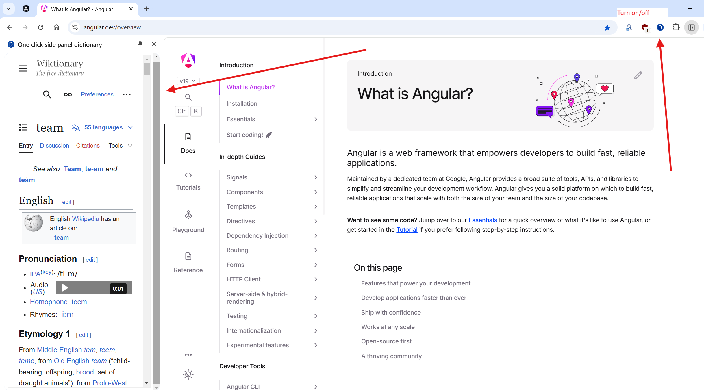
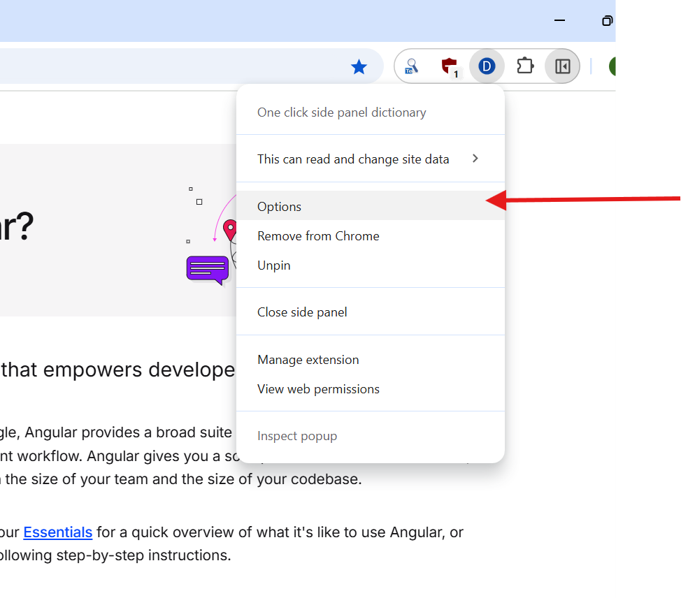
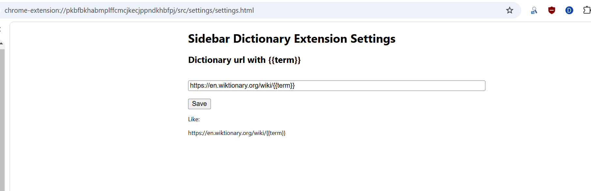
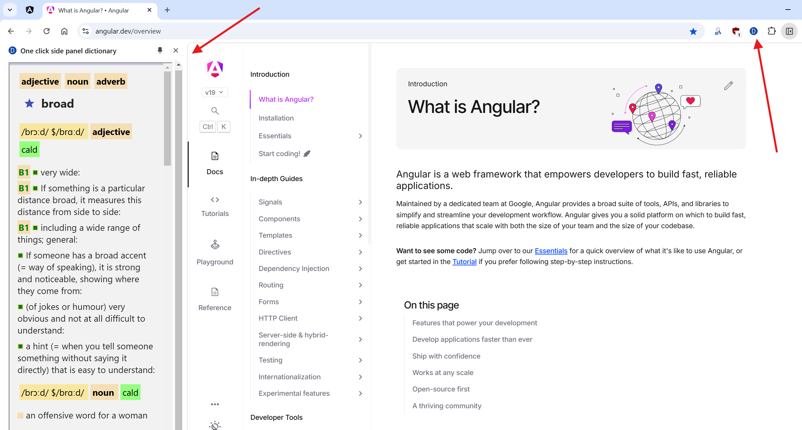

# One click side panel dictionary (Chrome extension)

[https://chromewebstore.google.com/detail/one-click-side-panel-dict/bihbnoacpbepagocdgpghehbdeacdfjh](https://chromewebstore.google.com/detail/one-click-side-panel-dict/bihbnoacpbepagocdgpghehbdeacdfjh)

## Description

If you turn on this extension then you have just click on a word to see the dictionary for this word.

It uses an external online dictionary via iframe. You can use settings to change the link for it.

I created it to use with "Foreign reader dictionary",
but you have to import (and maybe to create) a json dictionary for that,
so it simpler to use other dictionary.

You can use "wiktionary.org" or any other dictionary which don't mind to be used in iframe.
Note that Longman dictionary and CALD dictionary don't want to work in iframe.

## Setting examples:

https://en.wiktionary.org/wiki/{{term}}

https://andrew2020wit.github.io/foreign-reader/dictionary-viewer?hideInput=true&hideMenu=true&term={{term}}

## Screenshots

## Links 

https://github.com/andrew2020wit/foreign-reader

## Foreign reader dictionary

It was created to use with [Foreign reader dictionary](https://github.com/andrew2020wit/foreign-reader).

To use "Foreign reader dictionary" you have to import json dictionary.

You can use simple dictionary from here:

[https://github.com/andrew2020wit/foreign-reader/tree/master/dictionary](https://github.com/andrew2020wit/foreign-reader/tree/master/dictionary)

- main-dictionary: wordset-with-tr.json
- any way you also have to import morphology.json and morphology-replace-rules.json (see folder above)

You can also create json-dictionary based on Cambridge Advanced Learner's Dictionary 4th, mdx format:

[Convert mdx-dictionary to json-dictionary](https://github.com/andrew2020wit/cald-mdx-to-json)

## Load an unpacked extension

https://developer.chrome.com/docs/extensions/get-started/tutorial/hello-world#load-unpacked

## Licence

MIT. It's free to use.